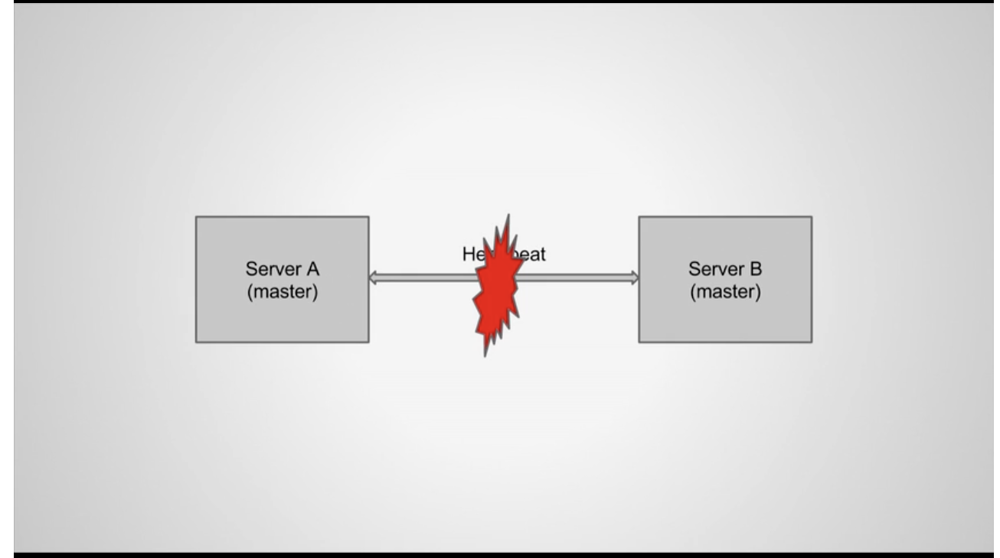
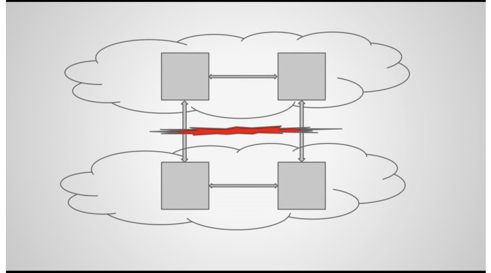
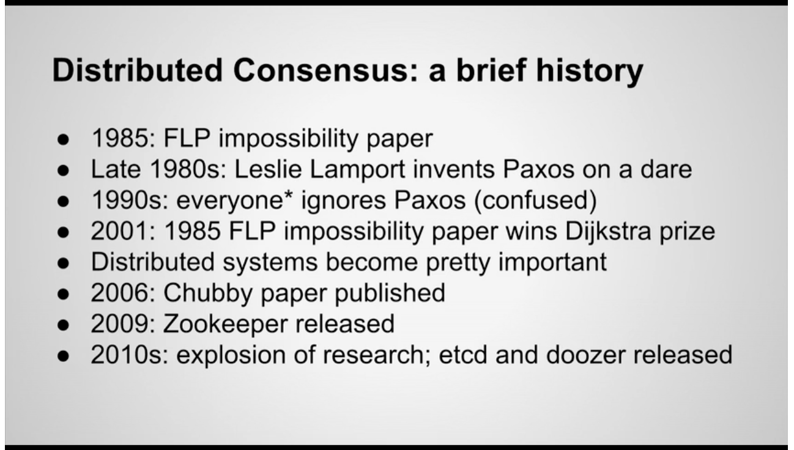

# Distributed Consensus Algorithms

[Consensus Wikipedia](https://en.wikipedia.org/wiki/Consensus_(computer_science))

## Distributed Consensus Algorithms for Extreme Reliability

[Talk](https://www.usenix.org/conference/srecon15europe/program/presentation/nolan) and [slides](https://www.usenix.org/sites/default/files/conference/protected-files/srecon15europe_slides_nolan.pdf)
  

[Split-brain Problem Wikipedia](https://en.wikipedia.org/wiki/Split-brain_(computing))

Other consensus algorithms
* [Viewstamped Replication](https://dl.acm.org/doi/10.1145/62546.62549)
* [RAFT Wikipepdia](https://en.wikipedia.org/wiki/Raft_(algorithm))
* [Zookeeper Atomic Broadcast (ZAB) Protocol Wikipedia](https://en.wikipedia.org/wiki/Atomic_broadcast)
* [Mencius](https://www.usenix.org/legacy/event/osdi08/tech/full_papers/mao/mao_html/index.html)
* Many variants of Paxos ([Fast Paxos Wikipedia](https://en.wikipedia.org/wiki/Paxos_(computer_science)#Fast_Paxos), Egalitarian Paxos, etc.)
